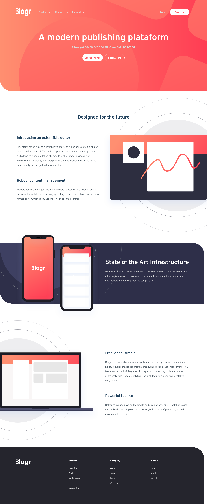

<h1 align="center">Frontend Mentor - Blogr landing page solution</h1>

  This is a solution to the <a href="https://www.frontendmentor.io/challenges/blogr-landing-page-EX2RLAApP">Blogr landing page challenge on Frontend Mentor</a>. 
  Frontend Mentor challenges help you improve your coding skills by building realistic projects. 

## Table of contents

- [Overview](#overview)
  - [The challenge](#the-challenge)
  - [Screenshot](#screenshot)
  - [Links](#links)
- [My process](#my-process)
  - [Built with](#built-with)
  - [What I learned](#what-i-learned)
  - [Continued development](#continued-development)
- [Author](#author)

## Overview

### The challenge

Users should be able to:

- View the optimal layout for the site depending on their device's screen size
- See hover states for all interactive elements on the page

### Screenshot

</img>

### Links

- Solution URL: [My Solution](https://www.frontendmentor.io/solutions/landing-page-responsive-made-with-html-css-and-javascript-u3ohhvorQ)
- - Live Site URL: [Live Site](https://blogr-landing-page-ivory.vercel.app/)

## My process

### Built with

- [HTML](https://html.com/)
- [CSS](https://www.w3.org/Style/CSS/Overview.en.html)
- [JavaScript](https://www.javascript.com/)

### What I learned

With this project I learnd how to do a dropdown menu using only html and css, that z-index only work when the position is different than static, use svg images and I get better in position background images.

### Continued development

My JavaScript skills, and now I want to learn SASS because I take a long time to do the HTML and CSS, it would be cool for me learn some tool that would make this process a little more faster.

## Author

<h3 align="center">Rafael Tavares</h3>

 <a href="https://www.facebook.com/rafael.tavares.39904/"></img></a>
 <a href="https://www.instagram.com/rafatavares03/"></img></a>

